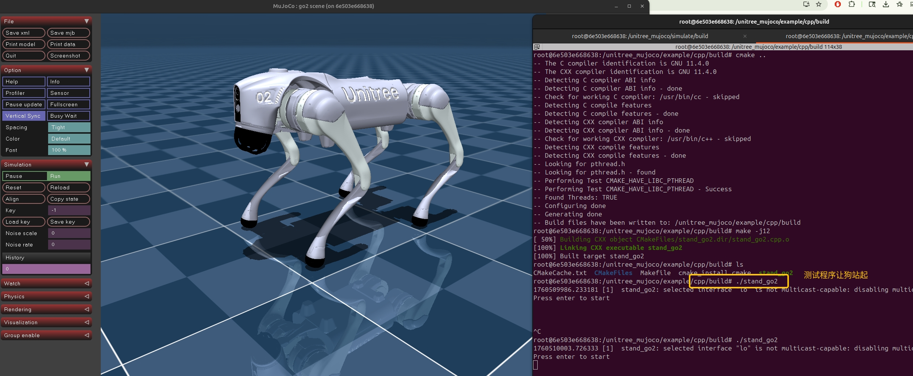

## Running the Demo

### 1. Build the Docker Image
```sh
docker build -t unitree_mujoco .
```
The image name `unitree_mujoco` can be customized. All necessary components are compiled during the Docker image build process.

### 2. Launch the Simulator

```sh
xhost +local:docker
docker run -it --rm -e DISPLAY=$DISPLAY -v /tmp/.X11-unix:/tmp/.X11-unix -v $PROJECT_SOURCE_DIR:/workspace --gpus all --name sim unitree_mujoco bash
```

**Notes:**
*   The flags `-e DISPLAY=$DISPLAY -v /tmp/.X11-unix:/tmp/.X11-unix` are required for GUI forwarding, allowing the simulation window to be displayed from the container.
*   `xhost +local:docker`  allows container to talk to your host’s X server via /tmp/.X11-unix socket.
*   **GPU and CPU Support:** The current configuration is optimized for NVIDIA GPUs.
    *   **With GPU:** The `dockerfile` uses `nvidia/opengl:base-ubuntu22.04` as the base image. The `--gpus all` flag is necessary in the `docker run` command. This requires the [NVIDIA Container Toolkit](https://docs.nvidia.com/datacenter/cloud-native/container-toolkit/latest/install-guide.html) to be installed on the host machine.
    *   **Without GPU:** For CPU-only execution, modify the `dockerfile` to use a base image like `ubuntu:22.04` and remove the `--gpus all` flag from the `docker run` command.

Once inside the container, start the simulation:
```sh
cd /unitree_mujoco/simulate/build/
./unitree_mujoco -r go2 -s scene_terrain.xml
```

### 3. Run the Go2 Standing Controller
Open a second terminal and attach to the running container:
```sh
docker exec -it sim bash
```
Then, execute the standing controller:
```sh
cd /unitree_mujoco/example/cpp/build
./stand_go2
```

A successful launch will display the following simulation environment:



### TODO
- [ ] Refactor the `dockerfile` to download the MuJoCo binary during the image build process instead of relying on a local copy.


### References
[1] [unitreerobotics/unitree_mujoco](https://github.com/unitreerobotics/unitree_mujoco) GitHub repository

[2] [unitreerobotics/unitree_sdk2](https://github.com/unitreerobotics/unitree_sdk2) GitHub repository

[3] [google-deepmind/mujoco](https://github.com/google-deepmind/mujoco/releases) binary releases
